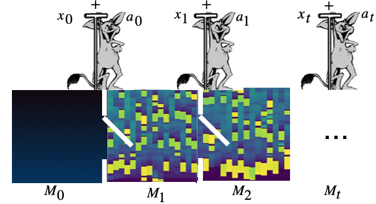

# Differentiable Neural Computers with Memory Demon

This is pytorch implementation of "Differentiable Neural Computers" with Memory Demon presented at 
NeurIPS 2022 Workshop On Memory in Artificial and Real Intelligence.

#To repeat the baby experiments:
`python memory_demon.py -name tmp_train_dir -profile babi,dnc-msd`

#Acknowledgment:
This code uses the pytorch DNC implementation of 
https://github.com/RobertCsordas/dnc